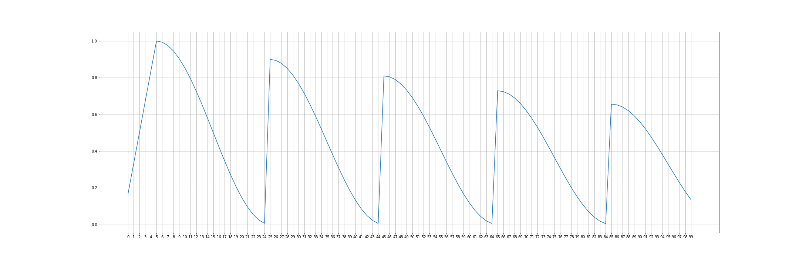

# CosineAnnealingWarmRestarts with initial linear Warmup followed by weight decay for PyTorch

## Installation
```bash
pip install 'git+https://github.com/saadnaeem-dev/pytorch-linear-warmup-cosine-annealing-warm-restarts-weight-decay'
```

## Args
- otomiser (Optimizer): any optimizer from torch.optim library
- T_0: (int) First cycle step size, Number of iterations for the first restart.
- T_mul: multiplicative factor Default: -1., A factor increases T_i after a restart
- eta_min: Min learning rate. Default: 0.001.
- max_lr: warmup's max learning rate. Default: 0.1.
- warmup_steps: Linear warmup step size. Default: 0. Number of iterations required to reach max_lr
- gamma: decay factor values between 0-1 between (1.0 no decay)
- last_epoch: The index of last epoch. Default: -

## Example
```
>> from linear_warmup_cosine_annealing_warm_restarts_weight_decay import ChainedScheduler
>>> import torch
>>> import torch.optim as optim
>>> from torchvision.models import AlexNet
>>> from torch.optim import lr_scheduler
>>> import matplotlib.pyplot as plt
>>> import matplotlib
>>> optimizer = optim.SGD(model.parameters(), lr=0.1, momentum=0.9, weight_decay=1e-1)
>>> model = AlexNet(num_classes=2)

>>> optimizer = optim.SGD(model.parameters(), lr=0.1, momentum=0.9, weight_decay=1e-1)
>>> scheduler = ChainedScheduler(
>>>                 optimizer,
>>>                 T_0 = 20,
>>>                 T_mul = 1,
>>>                 eta_min = 0.0,
>>>                 gamma = 0.9,
>>>                 max_lr = 1.0,
>>>                 warmup_steps= 5 ,
>>>             )

>>> scheduler = ChainedScheduler(
>>>                 optimizer,
>>>                 T_0 = 20,
>>>                 T_mul = 1,
>>>                 eta_min = 0.0,
>>>                 gamma = 0.9,
>>>                 max_lr = 1.0,
>>>                 warmup_steps= 5 ,
>>>             )


>>> fig = matplotlib.pyplot.gcf()
>>> matplotlib.rcParams['figure.figsize'] = [18.5, 10]
>>> x = list(range(100))
>>> y = []

>>> for epoch in range(100):
>>>     optimizer.step()
>>>     scheduler.step()
>>>     y.append(scheduler.get_lr()[0])

>>> fig, axes = plt.subplots(1, 1)
>>> xticks = range(min(x), max(x) + 1)
>>> axes.set_xticks(xticks)
>>> plt.plot(xticks, y)
>>> plt.grid()
>>> plt.show()
```
- above snippet produces : 


### Further examples and detailed use cases can be found in doc strings of lr_scheduler.py file